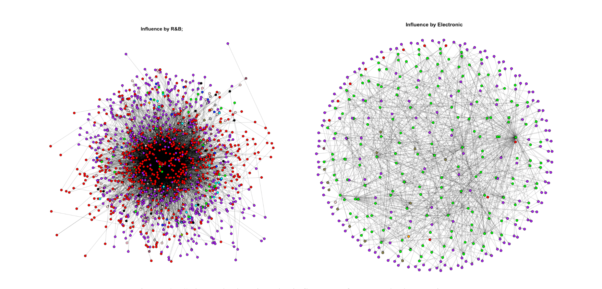
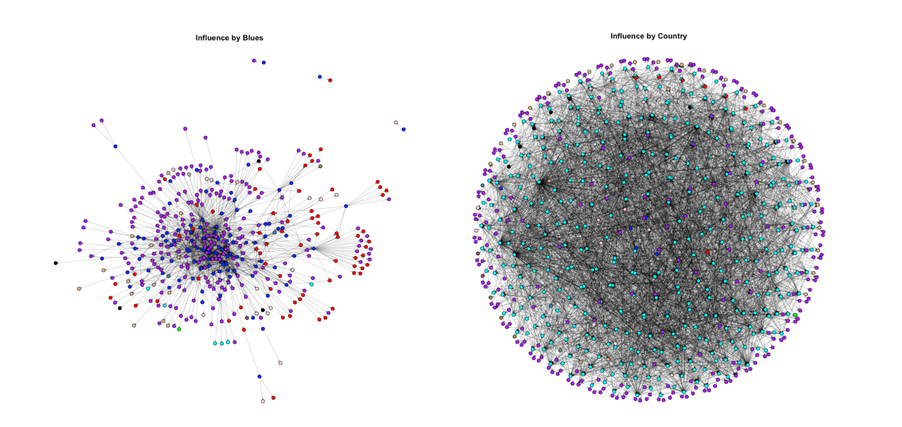
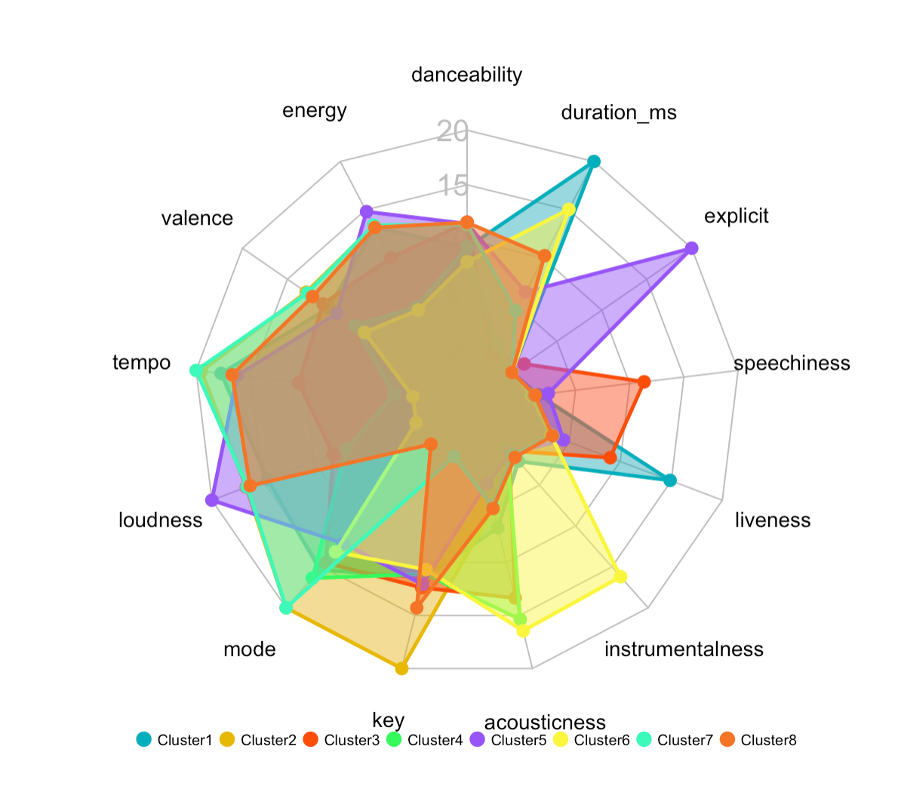
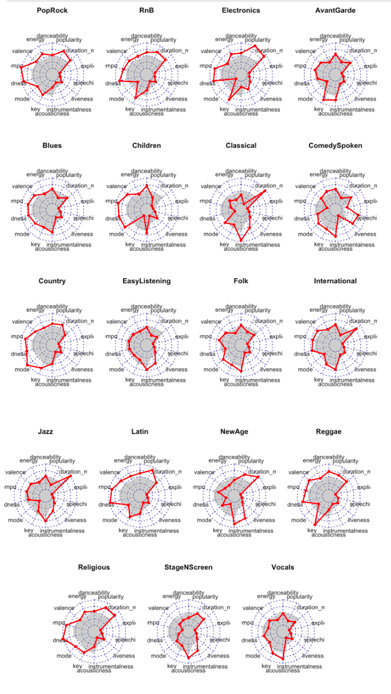

```{r setup, include=FALSE}
library(highcharter)
library(dplyr)
library(viridisLite)
library(forecast)
library(treemap)
library(flexdashboard)
library(streamgraph)
library(dplyr)
library(streamgraph)
library(tidyverse)


thm <- 
  hc_theme(
    colors = c("#1a6ecc", "#434348", "#90ed7d"),
    chart = list(
      backgroundColor = "transparent",
      style = list(fontFamily = "Source Sans Pro")
    ),
    xAxis = list(
      gridLineWidth = 1
    )
  )

```

```{r}
library(naniar)
library(knitr)
library(skimr)
library(tidyverse)
library(tidymodels)
library(leaflet)
library(vip)
library(rattle)
library(sf)
library(heatmaply)
library(dash)
library(ggthemes)
library(patchwork)  
library(GGally) 
library(dashCoreComponents)
library(dashHtmlComponents)
library(plotly)
library(readr,  warn.conflicts=F)
library(RColorBrewer,  warn.conflicts=F) #Rcolorbrewer palette
library(corrplot,  warn.conflicts=F)
library(ggcorrplot,  warn.conflicts=F)
library(plotly,  warn.conflicts=F)
library(ggplot2, warn.conflicts=F)
library(reshape, warn.conflicts=F)
library(viridis, warn.conflicts=F)
library(tidyverse, warn.conflicts=F)
library(hrbrthemes, warn.conflicts=F)
library(psych, warn.conflicts=F)
library(class, warn.conflicts=F)
library(caret, warn.conflicts = F)
library(DescTools)
library(sjPlot)
library(kernlab)
library(caret)
library(Matrix)
library(kableExtra)
library(plotly)
library(shiny)
library(maps)
library(tidyverse)
library(skimr)      # skimming data frames
library(ggthemes)
library(patchwork)  # combine separate ggplots into the same graphic
library(GGally)     # ggpairs()
library(corrplot)
library(readr,  warn.conflicts=F)
library(RColorBrewer,  warn.conflicts=F) #Rcolorbrewer palette
library(corrplot,  warn.conflicts=F)
library(ggcorrplot,  warn.conflicts=F)
library(plotly,  warn.conflicts=F)
library(ggplot2, warn.conflicts=F)
library(reshape, warn.conflicts=F)
library(viridis, warn.conflicts=F)
library(tidyverse, warn.conflicts=F)
library(hrbrthemes, warn.conflicts=F)
library(psych, warn.conflicts=F)
library(class, warn.conflicts=F)
library(caret, warn.conflicts = F)
library(DescTools)
library(sjPlot)
library(ggplot2)
library(dplyr)
library(forcats)
library(hrbrthemes)
library(viridis)

```


```{r}
# Create data:
data <- read_csv("/Users/aniketsingh/Desktop/music/pop.csv")
library(ggplot2)
library(dplyr)

data$year <- as.integer(data$year)
data$popularity <- as.double(data$popularity)
data$Genre <- as.factor(data$Genre)    

normalize <- function(x) {
return ((x - min(x)) / (max(x) - min(x))) }
data$popularity <- normalize(data$popularity)

p1 <- streamgraph(data, key="Genre", value="popularity", date="year", height="300px", width="1000px")
```


Visualization
=======================================================================
Rows { data-height=250}
-----------------------------------------------------------------------

### Popularity of Music 

```{r}
p1
```

### Subgraphs showing influence of R&B and Electronic

```{r}
 
```


### Subgraphs sowing th influence of Blues and Country
```{r}
 
```

Column {.tabset data-width=400}
-----------------------------------------------------------------------
### Similarities between Music
```{r}
 
```


### Differences in Music
```{r}
 
```


### Insights

- Although music genres are different types of musics, we did see similarities between some genres through the clusters.
- The influencer does influence the music produced by the follower for most of the cases.
- Most genres influence themselves, but we saw some genres influencing one more than other. PopRock is the most influential genre among all, and it is also the most influenced genre.
- The Beatles,Bob Dylan and The Rolling Stone are the top influencing artists. All of them had a start year in 1960s. This also played a great role in the revolution of music that came in 1960. The Beatles is the most influential artist among all.
- The 60s, 70s and 80s are the most important decades in the music history. We found 60s to be the most influential, while the 90s is the most influenced decade.
- We studied the effect of social and technological changes through our network and discovered that they have played an important role in the evolution of music and musical characteristics over time.